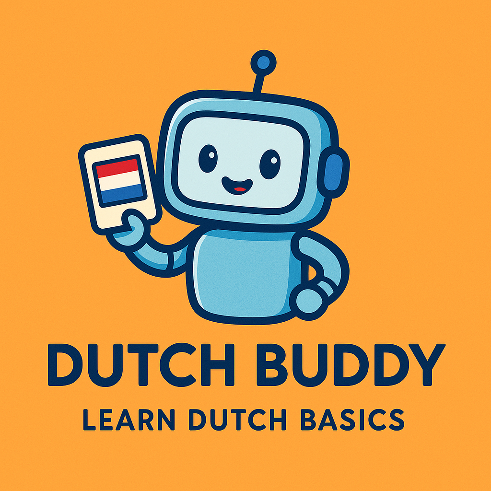

<div align="center">
  
  
  # Dutch Buddy
  ### *Your friendly companion for learning Dutch basics* 🇳🇱
  
  [](https://www.java.com/) 
  [](https://developer.android.com/)
  [](LICENSE)
</div>

<p align="center">
  <i>A beginner-friendly Android app that makes learning Dutch vocabulary simple, interactive, and fun! Perfect for travelers and language enthusiasts.</i>
</p>

## ✨ Overview

**Dutch Buddy** helps you learn Dutch vocabulary through interactive flashcards and quizzes. Words and phrases are organized into categories like Greetings, Food, and Travel, making it easy to focus on specific topics. The app works completely offline, so you can learn anytime, anywhere!

## 🌟 Features

- **📚 Category-Based Learning** - Learn Dutch words and phrases organized by everyday topics
- **🔄 Interactive Flashcards** - Swipe through cards with smooth animations to study vocabulary
- **🎯 Fun Quizzes** - Test your knowledge with engaging multiple-choice quizzes
- **📱 Offline Support** - All content stored locally for learning on-the-go
- **🎨 Modern UI** - Clean, intuitive interface designed for an enjoyable learning experience

## 📋 Requirements

- Android Studio (2023.1.1 or newer)
- Java 8+
- Android 5.0+ (API Level 21 or higher)

## 🚀 Installation

1. Clone this repository:
   ```bash
   git clone https://github.com/yourusername/dutch-buddy.git
   cd dutch-buddy
   ```

2. Open the project in **Android Studio**

3. Build and run the app on your favorite emulator or physical device

## 📁 App Structure

```
dutch-buddy/
├── app/
│   ├── src/
│   │   ├── main/
│   │   │   ├── java/                # Java source code
│   │   │   ├── res/                 # XML layouts and resources
│   │   │   ├── AndroidManifest.xml  # App configuration
│   │   └── test/                    # Unit tests
├── database/                        # SQLite database for vocabulary
├── README.md                        # This file
└── LICENSE                          # License file
```

## 📱 Usage

### 🔤 Flashcards

1. Select a category from the main screen (e.g., Greetings, Food, Travel)
2. Swipe through flashcards to study Dutch words and their English translations
3. Tap any card to flip it and reveal the translation

### 📝 Quizzes

1. Choose a category and start the quiz
2. Answer multiple-choice questions based on Dutch vocabulary
3. View your score at the end and track your progress

## 🔮 Future Improvements

- [ ] Add audio pronunciation for Dutch words
- [ ] Implement progress tracking and gamification features
- [ ] Expand the vocabulary database with more categories
- [ ] Add speech recognition for practicing pronunciation
- [ ] Include animations for flashcard transitions

## 📄 License

This project is licensed under the MIT License - see the [LICENSE](LICENSE) file for details.

## 💙 Acknowledgments

- The Android development community for resources and tutorials
- Dutch language learners for inspiring the creation of this app
- Open-source contributors for tools and libraries used in the project

---

<p align="center">
  <i>Gemaakt met liefde</i> ❤️ <i>(Made with love)</i>
</p>